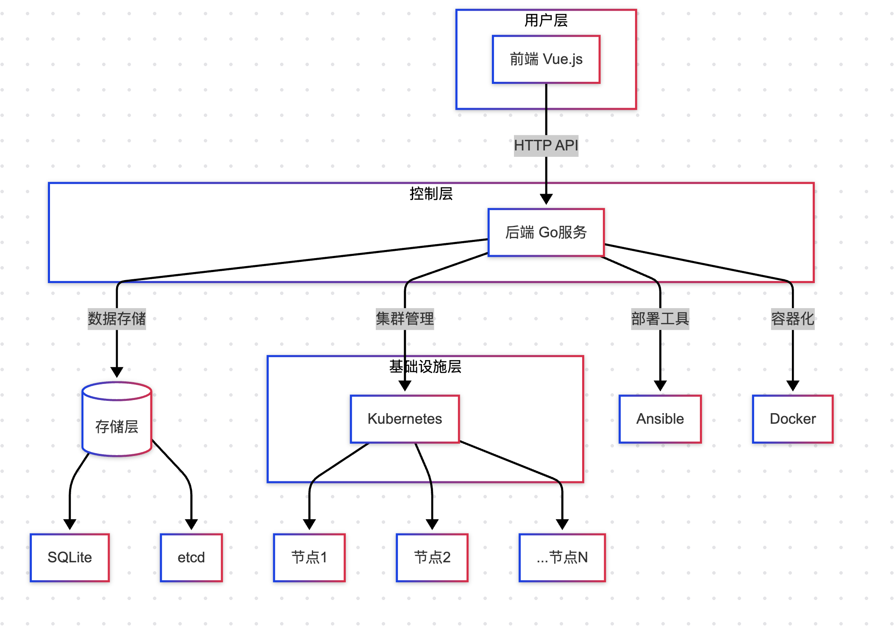
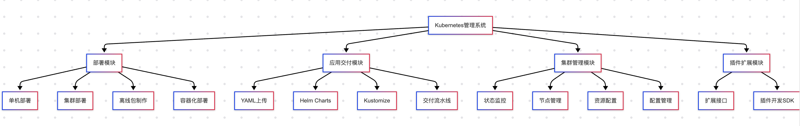

# Kubernetes Dashboard Engine (KDE)

KDE 是一个基于 Go 语言开发的 Kubernetes 管理平台，提供集群部署、应用交付和集群管理等功能。

## 架构设计

### 技术栈
- **后端**: 使用 Go 语言开发，采用单体架构
- **前端**: 使用 Go 模板引擎，Bootstrap 框架
- **数据库**: SQLite（支持 etcd 作为备选）
- **部署工具**: Ansible，支持 RKE 部署方式

### 系统架构
```
KDE
├── 前端界面 (Go Template + Bootstrap)
├── API 服务层
├── 业务逻辑层
├── 数据访问层 (SQLite/etcd)
└── 部署引擎 (Ansible)
```





## 核心功能

### 1. Kubernetes 部署管理
- 支持单机和集群部署
- 多操作系统版本适配
- 基于 Ansible 的自动化部署
- 支持 RKE 容器化部署方式
- 支持离线包制作，适配不同操作系统发行版

### 2. 应用交付
- 支持多种部署方式：
  - Kubernetes YAML 文件
  - Helm Charts
  - Kustomize 配置
- 支持流水线式交付
- 支持模板渲染和变量替换

### 3. 集群管理
- 集群状态监控
- 节点管理
- 资源使用统计
- 集群配置管理

### 4. 扩展性
- 预留插件接口
- 支持自定义部署策略
- 支持自定义资源管理

## 快速开始

### 环境要求
- Go 1.24+
- SQLite3
- Ansible
- Docker (可选，用于容器化部署)

### 安装步骤
1. 克隆项目
```bash
git clone https://github.com/huyouba1/kde.git
cd kde
```

2. 安装依赖
```bash
go mod tidy
```

3. 配置
```bash
cp configs/config.example.yaml configs/config.yaml
# 编辑配置文件
vim configs/config.yaml
```

4. 运行
```bash
go run cmd/server/main.go
```

5. 访问
打开浏览器访问 http://localhost:8080

## 项目结构
```
kde/
├── cmd/                # 命令行入口
├── configs/           # 配置文件
├── pkg/               # 核心代码
│   ├── api/          # API 服务
│   ├── deploy/       # 部署引擎
│   ├── storage/      # 数据存储
│   └── utils/        # 工具函数
├── scripts/          # 部署脚本
├── web/              # 前端资源
└── data/             # 数据目录
```

## 开发指南

### 代码规范
- 遵循 Go 标准代码规范
- 使用 gofmt 格式化代码
- 编写单元测试

### 贡献流程
1. Fork 项目
2. 创建特性分支
3. 提交更改
4. 发起 Pull Request

## 许可证
MIT License - 详见 [LICENSE](LICENSE) 文件